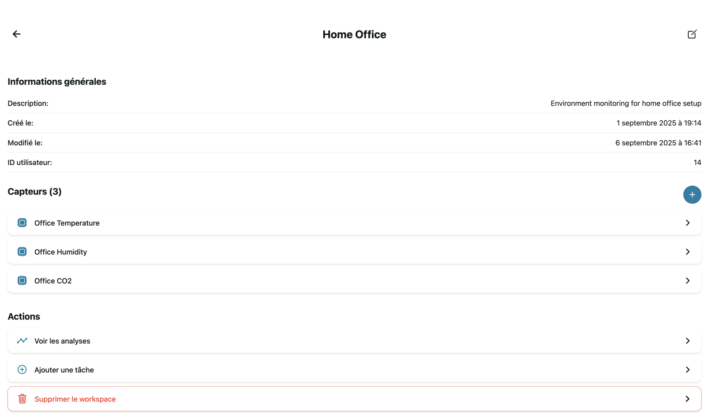
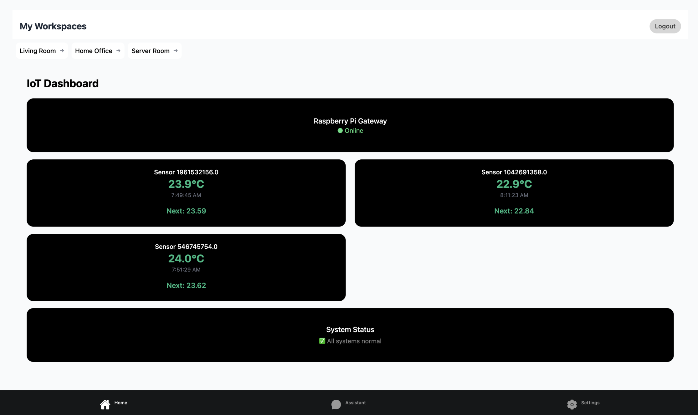
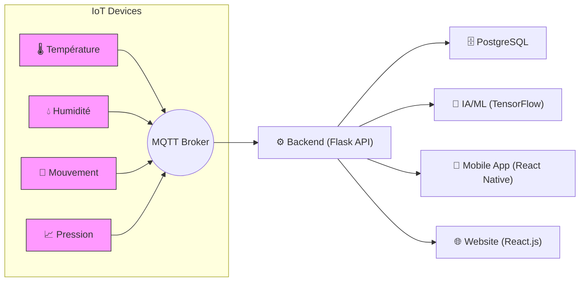

# 🛰️ Sent-io

## 📖 Contexte  

Le projet **Sent-io** est un système de surveillance intelligente d'une pièce intérieure, basé sur l'IoT et l'IA.  
L'objectif est de collecter et analyser en temps réel des données environnementales (température, humidité, pression, accélération ) afin de :  

- Améliorer la sécurité et le confort de l'espace.  
- Offrir une visualisation claire via une application mobile et un site web.  
- Exploiter l'intelligence artificielle pour détecter des anomalies et prédire des comportements.  

### 🌐 Applications




### 🌐 Web Dashboard Admin



---

## 🎯 Fonctionnalités principales

- 📡 **Collecte de données** : récupération en temps réel des données des capteurs (MQTT).  
- 📊 **Analyse IA** : détection de mouvements suspects, anomalies environnementales, prédictions.  
- 📱 **Application mobile (React Native)** :  
  - Dashboard en temps réel.  
  - Accès multi-utilisateur.  
- 🌐 **Website (React)** :  
  - Vue globale du système.  
  - Interface d'administration.  
  - Accès aux historiques et graphiques.  
- ⚙️ **Backend (Flask + PostgreSQL)** :  
  - API centralisée.  
  - Stockage et traitement des données.  
  - Authentification et gestion des rôles.  

---

## 🏗️ Architecture du projet  




---

## 📂 Organisation du projet  

```
smart-room-monitoring/
│── backend/             # API & traitement des data (Flask)
│── frontend/            # App mobile React Native
│── website/             # Site web (React)
│── docs/                # Documentation et schémas
│── docker-compose.yml   # Orchestration des services
│── README.md            # Ce fichier
```

---

## 🚀 Installation & Lancement  

### Via Docker

```bash
docker compose up --build
docker compose exec -it web flask db upgrade
docker compose exec -it web python seed.py

#lstm
docker compose exec -it python data_gen.py 

docker compose exec -it curl -X POST http://127.0.0.1:5000/api/lstm/train -H "Content-Type: application/json" -d @daily_temps_week.json 
```

### 2️⃣ Frontend  

```bash
cd frontend
npm install
npm rum web  # ou run-ios
```

### 3️⃣ Website  

```bash
cd website
npm install
npm rum web
```

---

## 👥 Types d’utilisateurs  

- **👤 Utilisateur standard** : commande des capteurs, consulte les données via l'app mobile et reçoit des alertes.  
- **🔐 Administrateur** : configure les capteurs, crée les taches,  gère les comptes et a un accès global.  

---

## 🛠️ Technologies utilisées  

- **Backend** : Python (Flask/FastAPI), PostgreSQL, MQTT.  
- **Frontend Mobile** : React Native.  
- **Website** : React / Next.js.  
- **AI/ML** : modèles de détection d’anomalies (Python).  
- **Infra** : Docker  

---

## 📌 Liens Utils

- <https://sent-io.site/> -> SITE WEB
- <https://backend.sent-io.site/> -> backend
- <https://dashboard.sent-io.site/> -> Dashboard flower
- <https://app.sent-io.site/>  -> mobile, pas encore dispo
- <https://db.sent-io.site/>  -> adminer
- <https://nginx.sent-io.site/>  -> nginx
- <https://prom.sent-io.site/>  -> prometheuse
- <https://grafana.sent-io.site/>  -> grafana

---

## 👨‍🎓 Équipe projet  

Projet réalisé dans le cadre de la production **Bachelor Développeur Web** à HETIC.  

- Jiad ABDUL
- Faithgot Glin-Dayi
- Ahmat Rouchad
- Paul CHARBEL
- Hugo Cialpucha
